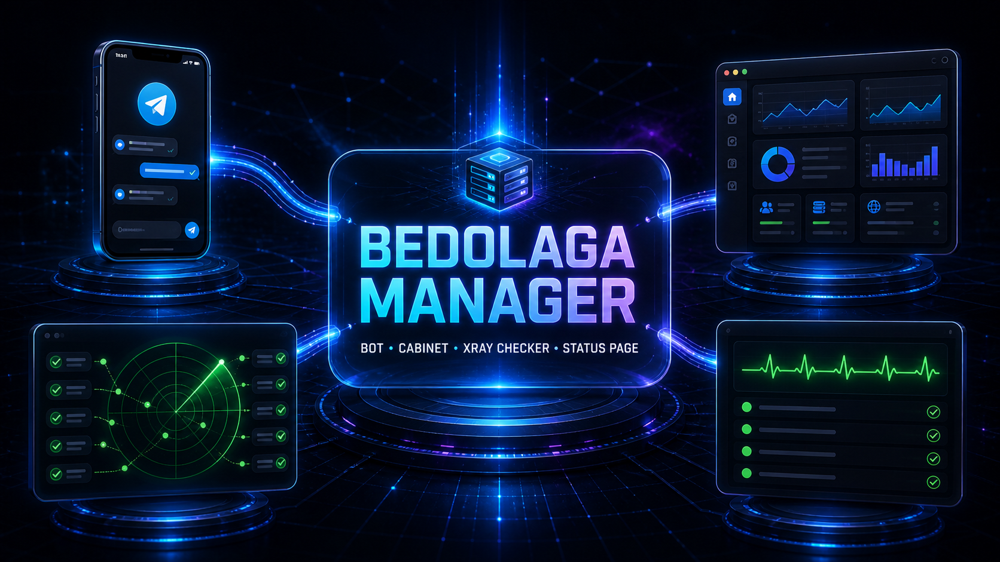
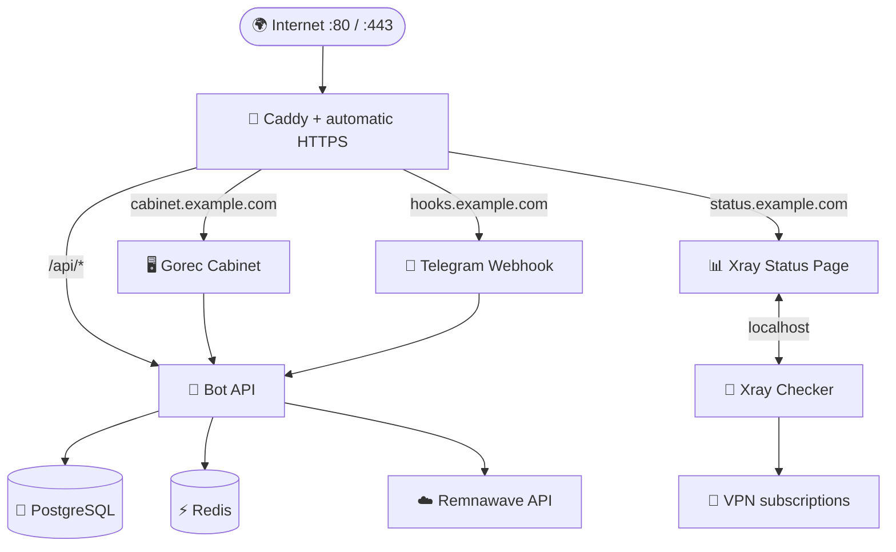

<div align="center">

# 🚀 Gorec Auto Installer

### GorecBot + Cabinet + Xray Checker + Status Page одной командой

[](https://github.com/gorecvpn/Gorec-auto-install-/actions/workflows/ci.yml)
[](https://github.com/gorecvpn/Gorec-auto-install-/actions/workflows/security.yml)
[](LICENSE)
[](https://www.gnu.org/software/bash/)

**Автоматическая установка · Xray Monitoring · HTTPS · Обновления · Бэкапы · Диагностика**

[Быстрый старт](#quick-start) · [Возможности](#features) · [Управление](#management) · [Архитектура](#architecture) · [Поддержка](#support)

</div>



> [!NOTE]
> **Gorec Manager** разворачивает [GorecBot](https://github.com/gorecvpn/GorecVPN-), [Gorec Cabinet](https://github.com/gorecvpn/Gorec-Cabinet), PostgreSQL, Redis и Caddy. По желанию тот же мастер устанавливает [Xray Checker](https://github.com/kutovoys/xray-checker) и [Xray Checker Status Page](https://github.com/Mrvibecodic/xray-checker-statuspage/tree/go-build).

---

<a id="features"></a>
## ✨ Возможности

| | Возможность | Что получает пользователь |
|:--:|---|---|
| ⚡ | **Установка одной командой** | Проверка сервера, установка зависимостей и запуск всего стека |
| 🧙 | **Интерактивный мастер** | Пошаговая настройка Telegram, Remnawave, доменов и брендинга |
| 🔐 | **Безопасные секреты** | Локальная генерация паролей, JWT и webhook/API secrets через OpenSSL |
| 🌐 | **Автоматический HTTPS** | Caddy получает и продлевает TLS-сертификаты для Bot и Cabinet |
| 🔄 | **Контролируемые обновления** | Бэкап перед обновлением, health checks и автоматический откат при ошибке |
| 💾 | **Резервные копии** | PostgreSQL, конфигурация и данные с SHA-256 проверкой целостности |
| 🩺 | **Встроенная диагностика** | Проверка DNS, HTTPS, API, Docker Compose и состояния контейнеров |
| 🛡️ | **Безопасная сеть** | Наружу открыты только веб-порты, PostgreSQL и Redis изолированы |
| 📡 | **Опциональный Xray Monitoring** | Проверка прокси, публичная Status Page и отдельный Telegram-бот управления |

---

<a id="quick-start"></a>
## 🚀 Быстрый старт

Запустите на **чистом сервере** от имени `root`:

```bash
bash <(curl -fsSL https://raw.githubusercontent.com/gorecvpn/Gorec-auto-install-/main/install.sh)
```

Установщик проверит систему, задаст вопросы по конфигурации, развернёт сервисы и проверит их работоспособность. После завершения откройте главное меню:

```bash
gorec
```

<details>
<summary><strong>📋 Требования к серверу и подготовка</strong></summary>

### Сервер

- Ubuntu 22.04 / 24.04 или Debian 12;
- минимум 1 GB RAM и 4 GB свободного места;
- рекомендуется 2 GB RAM и 10 GB свободного места;
- свободные входящие порты `80` и `443`;
- доступ пользователя `root`.

### Что подготовить заранее

- два домена с A-записями на IP сервера: для webhook и Cabinet;
- токен Telegram-бота;
- Telegram ID администратора или администраторов;
- URL и API key работающей Remnawave Panel;
- email для выпуска Let's Encrypt сертификатов.
- для опционального Xray Monitoring: ещё один домен и URL VPN-подписки.

</details>

> [!IMPORTANT]
> Установщик **не разворачивает Remnawave Panel**. Она должна быть установлена заранее и доступна по API.

### Что спросит мастер

1. Telegram Bot Token и ID администраторов.
2. URL и API key Remnawave.
3. Домены Telegram webhook и Cabinet.
4. Email для Let's Encrypt.
5. Название проекта, короткий логотип и часовой пояс.
6. Нужно ли установить Xray Checker + Status Page.

Если включить Xray Monitoring, мастер дополнительно запросит отдельный домен, URL одной или нескольких подписок, интервал проверок и, по желанию, токен **отдельного** Telegram-бота Status Page. Использовать токен основного GorecBot нельзя: основной бот работает через webhook, а Status Page использует собственный Telegram control plane.

Username бота определяется автоматически через Telegram API. Пароли PostgreSQL, JWT и служебные секреты генерируются локально.

> [!TIP]
> Перед вводом Telegram Bot Token мастер предложит два режима: **скрытый** для обычного SSH и **видимый** для web-консолей, блокирующих вставку в скрытые поля. Если в скрытом режиме значение не было получено, переключиться на видимый можно без перезапуска установки. Секреты не записываются в лог или историю команд.

---

<a id="management"></a>
## 🎛️ Управление

Запустите интерактивное меню без аргументов:

```bash
gorec
```

Меню автоматически использует цвета, эмодзи и Unicode-разделители в совместимом интерактивном терминале. Для минимального ASCII-вывода:

```bash
NO_COLOR=1 GOREC_EMOJI=0 gorec
```

Эмодзи можно принудительно включить через `GOREC_EMOJI=1`.

### ✨ Автообновление Manager

При открытии меню командой `gorec` Manager проверяет последний **стабильный GitHub Release**. Если доступна новая версия, перед установкой показываются:

- текущая и новая версии;
- понятное направление обновления, например `v1.2.0 → v1.3.0`;
- три главных изменения из changelog нового релиза.

Обновление выполняется автоматически из архива конкретного тега. Загруженная версия проходит проверку Bash-синтаксиса и пробный запуск; при ошибке установщик возвращает предыдущий Manager. Недоступность GitHub не блокирует открытие меню.

Чтобы не задерживать каждый запуск, успешная проверка кэшируется на один час. Отключить её для конкретного запуска:

```bash
GOREC_AUTO_UPDATE=0 gorec
```

Ручная проверка и обновление до последнего стабильного релиза:

```bash
gorec self-update
```

Или используйте отдельные команды:

| Команда | Назначение |
|---|---|
| `gorec status` | Состояние контейнеров и текущие версии |
| `gorec start` | Запустить весь стек |
| `gorec stop` | Остановить весь стек |
| `gorec restart [service]` | Перезапустить стек или отдельный сервис |
| `gorec logs [service]` | Открыть логи сервиса |
| `gorec doctor` | Проверить DNS, HTTPS, API и контейнеры |
| `gorec config wizard` | Повторно запустить мастер настройки |
| `gorec config bot` | Открыть конфигурацию Bot в редакторе |
| `gorec config stack` | Открыть системные параметры Compose |
| `gorec config paths` | Показать расположение всех файлов конфигурации |
| `gorec apply` | Применить `.env`, Caddy и branding |
| `gorec versions` | Сравнить локальные и доступные версии |
| `gorec update [all\|bot\|cabinet\|xray]` | Обновить весь проект или компонент |
| `gorec xray` | Открыть красивое меню Xray Monitoring |
| `gorec xray install` | Установить или перенастроить Xray Checker + Status Page |
| `gorec xray status` | Показать состояние, домен, интервал и используемые образы |
| `gorec xray logs [checker\|statuspage]` | Открыть логи модуля |
| `gorec xray update` | Обновить Checker и исходники Status Page с автоматическим откатом |
| `gorec xray disable` | Отключить модуль с сохранением настроек и данных |
| `gorec xray remove --purge-data` | Полностью удалить модуль и его данные |
| `gorec rollback` | Откатить последнее обновление приложений |
| `gorec backup` | Создать резервную копию |
| `gorec backup-list` | Показать доступные копии |
| `gorec restore <archive>` | Восстановить выбранную копию |
| `gorec schedule enable` | Включить ежедневные автобэкапы |
| `gorec firewall enable` | Настроить UFW для SSH, HTTP и HTTPS |
| `gorec self-update [vX.Y.Z]` | Обновить Manager до последней или указанной стабильной версии |

Доступные сервисы для `logs` и `restart`: `bot`, `cabinet`, `caddy`, `postgres`, `redis`, а при включённом модуле — `xray-statuspage` и `xray-checker`.

<details>
<summary><strong>📡 Как устроен Xray Monitoring</strong></summary>

- модуль выключен по умолчанию и никак не влияет на Bot/Cabinet;
- Xray Checker получает подписки через внутренний endpoint Status Page;
- оба сервиса используют общее изолированное сетевое пространство, необходимое upstream-проекту для связи через `localhost`;
- порты `2112`, `8080`, `8081` и диапазон Xray не публикуются на host;
- пользователи открывают Status Page только по отдельному HTTPS-домену через Caddy;
- Status Page собирается из официальной ветки `go-build`, поэтому установка работает на AMD64 и ARM64;
- база, ключ шифрования и настройки Status Page хранятся в `/var/lib/gorec/xray-statuspage` и входят в бэкапы Manager.

Для уже работающей установки сначала обновите Manager, затем запустите:

```bash
gorec self-update
gorec xray install
```

</details>

> [!TIP]
> После изменения конфигурации используйте `gorec apply`. Обычный `restart` не перечитывает переменные окружения уже созданного контейнера.

---

<a id="architecture"></a>
## 🏗️ Архитектура



- наружу публикуются только `80/TCP`, `443/TCP` и `443/UDP`;
- PostgreSQL и Redis находятся во внутренней Docker-сети;
- Bot и Cabinet не публикуют host-порты напрямую;
- опциональные Xray Checker и Status Page также не публикуют host-порты;
- Caddy автоматически получает и продлевает TLS-сертификаты;
- управляемые Docker-ресурсы получают label `dev.reibik.gorec.managed=true`.

Подробнее: [документация по архитектуре](docs/ARCHITECTURE.md).

---

## 🔄 Обновления и откат

Команда `gorec update` выполняет безопасный цикл обновления:

1. Проверяет отсутствие локальных изменений в upstream checkout.
2. Получает новые версии Bot и Cabinet.
3. Создаёт дамп PostgreSQL и бэкап конфигурации.
4. Собирает новые Docker-образы до перезапуска сервисов.
5. Запускает стек и ожидает успешные health checks.
6. При ошибке автоматически возвращает предыдущие версии приложений.

Если Xray Monitoring включён, `gorec update all` также создаёт бэкап, обновляет официальный image Checker и detached checkout ветки `go-build`. При неудачной сборке или health check Manager возвращает предыдущий commit Status Page и прежний image Checker.

Ручной откат:

```bash
gorec rollback
```

> [!WARNING]
> Откат версии приложения не отменяет миграции базы данных. Перед каждым обновлением создаётся полный бэкап; при несовместимости схемы используйте `gorec restore`.

---

## 💾 Резервные копии

В архив входят:

- дамп PostgreSQL в custom format;
- `stack.env`, `bot.env` и Caddyfile;
- постоянные данные, uploads и локали Bot;
- база, настройки и зашифрованные подписки Xray Status Page;
- версии Manager, Bot и Cabinet;
- SHA-256 checksum для проверки целостности.

Автобэкап запускается systemd timer примерно в `03:00`. По умолчанию хранятся семь автоматических архивов; ручные и аварийные копии автоматически не удаляются.

---

## 🔒 Безопасность

- конфигурационные каталоги создаются с правами `700`;
- файлы с секретами создаются с правами `600`;
- секреты не передаются сторонним генераторам;
- база данных и Redis недоступны напрямую из интернета;
- UFW учитывает текущий SSH-порт перед применением правил;
- CI проверяет ShellCheck, распространённые форматы секретов и опасные shell-паттерны.

Инструкции по ответственному раскрытию уязвимостей находятся в [SECURITY.md](SECURITY.md).

---

<details>
<summary><strong>📁 Расположение файлов на сервере</strong></summary>

```text
/usr/local/bin/gorec                 CLI
/usr/local/lib/gorec-manager/        код менеджера
/opt/gorec/compose.yaml              управляемый Docker Compose
/opt/gorec/sources/bot/              исходный код Bot
/opt/gorec/sources/cabinet/          исходный код Cabinet
/opt/gorec/sources/xray-statuspage/  ветка go-build опциональной Status Page
/etc/gorec/stack.env                 параметры Compose
/etc/gorec/bot.env                   конфигурация Bot
/etc/gorec/Caddyfile                 reverse proxy
/var/lib/gorec/bot/                  постоянные данные Bot
/var/lib/gorec/xray-statuspage/      данные опциональной Status Page
/var/lib/gorec/backups/              резервные копии
/var/lib/gorec/state/                состояние обновлений
```

Логотип сообщений можно заменить в `/var/lib/gorec/bot/vpn_logo.png` — upstream checkout останется чистым.

</details>

<details>
<summary><strong>🗑️ Безопасное удаление</strong></summary>

Удалить сервисы, сохранив данные и резервные копии:

```bash
gorec uninstall
```

Полностью удалить контейнеры, volumes, конфигурацию и бэкапы:

```bash
gorec uninstall --purge-data
```

Полное удаление необратимо и потребует ввода фразы `PURGE-GOREC`.

</details>

---

## 🧪 Разработка

```bash
bash -n gorec install.sh tests/*.sh lib/*.sh
shellcheck -x gorec install.sh tests/*.sh lib/*.sh
bash tests/smoke.sh
bash tests/lifecycle.sh
bash tests/xray.sh
bash tests/ui.sh
bash tests/manager-update.sh
```

CI дополнительно проверяет итоговый Docker Compose и запускает тесты в чистых контейнерах Ubuntu 22.04, Ubuntu 24.04 и Debian 12.

Рекомендации для участников: [CONTRIBUTING.md](CONTRIBUTING.md).

---

<a id="support"></a>
## 💰 Поддержка

Если проект оказался полезным, можете поддержать разработку:

| Сеть | Адрес |
|---|---|
| **TON** | `UQBoEJvftr-Lz4xZoXSDRlJQbaRC_nZoMhvbi9ufeiMNLTOb` |
| **USDT TRC20** | `TRu92kG4LZ7nmubW3o31x19WagejmNt9PC` |
| **BTC** | `bc1qy82xy9sqp2kq4rvqjqrvfdl9k0s7hvy7pk3rnt` |

> [!CAUTION]
> Перед отправкой проверьте адрес и выбранную сеть. Криптовалютные переводы необратимы.

Спасибо за поддержку проекта! 💜

---

## 🤝 Связанные проекты

- [GOREC-DEV / remnawave-gorec-telegram-bot](https://github.com/gorecvpn/GorecVPN-)
- [GOREC-DEV / gorec-cabinet](https://github.com/gorecvpn/Gorec-Cabinet)
- [Документация Gorec](https://gorecdev.mintlify.app/introduction)
- [kutovoys / xray-checker](https://github.com/kutovoys/xray-checker)
- [Mrvibecodic / xray-checker-statuspage (go-build)](https://github.com/Mrvibecodic/xray-checker-statuspage/tree/go-build)

---

## 📄 Лицензия

Gorec Auto Installer распространяется по лицензии [MIT](LICENSE). Устанавливаемые upstream-сервисы распространяются их авторами на условиях собственных лицензий.

<div align="center">

**Сделано с заботой о простой и безопасной установке** 💜

⭐ Если проект полезен — поставьте звезду репозиторию

</div>


---

> Working copy for **gorecvpn/Gorec-auto-install-**, based on [Reibik/Auto_Install-Bedolaga_Bot](https://github.com/Reibik/Auto_Install-Bedolaga_Bot).
